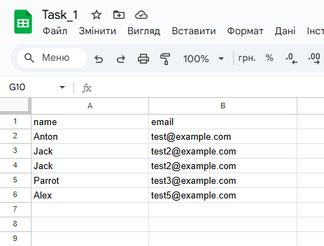

# Junior AI Developer Test Tasks Summary

## Working with n8n

I had not worked with the n8n service before. Usually, I worked with code-based solutions like LangChain, for example. That’s why I found it quite interesting to explore such a low-code solution.

I really enjoyed figuring out the mechanics of data exchange between nodes and services. I spent several days immersing myself in video tutorials, documentation, and hands-on experiments to better understand the platform's capabilities. The process of building these automations was genuinely exciting, and it even sparked ideas on how I could use similar solutions for my own personal productivity.

To configure any these three tasks, import the JSON file (located in this repository) into your n8n workspace. You will also need to set up credentials for your Google account, ClickUp account, and other necessary services.

I started with the registration process and familiarized myself with the environment — how to generally interact with it and how to add nodes. To begin, I decided to start with the simplest level to understand how it works before proceeding with my first task.

## First Task: Webhook and Google Sheets Integration

1. **Webhook Node**

   - I created a webhook node that received information via a `POST` request.
   - I sent test data using Postman, as I had experience with it from backend development when testing different endpoints.
   - I included screenshots of the test data submission process.
     ```
     {
     "name": "Alex",
     "email": "test5@example.com"
     }
     ```

2. **Google Sheets Node**

   - I authenticated using my Google account and created a separate Google Sheet for storing data.
   - The sheet contained two columns: `Name` and `Email`.
   - In the node settings, I mapped the received data to these two columns.
   - During testing, I confirmed that the data received through the webhook was successfully transmitted and stored in the correct fields of the Google Sheet.

3. **Gmail Node**
   - I added a Gmail node, which also required authentication via my Google account.
   - The node extracted the email from the previously received JSON data and sent a welcome email (e.g., thanking the user for registration).
   - I provided screenshots of the process, including data submission, storage in the spreadsheet, and email dispatch.

### Screenshots

- **Workflow in n8n:**
  
- **Webhook Test Execution:**
  
- **Updated Google Sheet:**
  
- **Sent Email Confirmation:**
  

### Conclusion

Overall, it was not difficult to understand. The main task was simply connecting my Google account, and everything else worked quite intuitively. I found the process interesting, and it even gave me ideas for creating a personal project using n8n.

---

## Second Task: Automation with ClickUp API

For this task, I needed to explore the ClickUp API, connect it to n8n, and process tasks from ClickUp to create Google calendar events only for high-priority tasks. Additionally, an email summary of all created events had to be sent via Gmail.

Although I had experience working with various task management services, ClickUp was new to me. It was interesting to understand how its API works. I spent some time exploring how the system processes task attributes retrieved via the API.

### Workflow Setup

1. **ClickUp API Connection**

   - I registered an account on ClickUp and created three test tasks.
   - I assigned high priority to two of them and added descriptions to test how the API extracts task details.
   - Each task was given a due date.

2. **Fetching Tasks from ClickUp**

   - I used an HTTP request node with the `GET` method to access the task list via the API and import it into n8n.
   - I explored nodes that execute JavaScript code.
   - I used these nodes to extract the necessary attributes, filter tasks by high priority, and transform the data.

3. **Creating Google Calendar Events**

   - Based on the filtered high-priority tasks, I created corresponding events in Google Calendar.
   - The event details included the task name, description, and due date.

4. **Sending Summary Email via Gmail**
   - I used another node to generate a report summarizing all created calendar events.
   - This report was then sent as an email via Gmail.

### Screenshots

- **Workflow in n8n**
  
- **Fetched Tasks from ClickUp**
  
- **Created Events in Google Calendar**
  
- **Confirmation Email**
  

### Conclusion

Working with the ClickUp API was an interesting experience. Despite being new to this service, I quickly got familiar with its API and how it structures tasks. Using JavaScript within n8n helped process and filter task data efficiently. Overall, the process was smooth, and I now have a better understanding of automating workflows with ClickUp.

---

## Third Task: Automating Task Extraction from Emails with OpenAI

For this task, I needed to use the OpenAI in n8n to analyze incoming emails in Gmail, detect whether they contained a task, and process them accordingly. If a task was detected, the workflow would:

1. Create an event in Google Calendar.
2. Add a task in ClickUp.
3. Send a confirmation email summarizing the created task.

### Workflow Setup

1. **Gmail Trigger and AI Analysis**

   - I created a Gmail trigger node to monitor incoming emails.
   - The emails were then passed to the OpenAI node, where a prompt instructed the model to determine whether the email contained a task.

2. **Conditional Processing**

   - If a task was detected, an `IF` node directed the workflow to the next steps.
   - The email content was passed to OpenAI again to generate a structured JSON template containing key task details.

3. **Data Formatting and Processing**

   - A JavaScript node was used to refine and structure the JSON output.
   - This structured task data was then sent to three different nodes:
     - **ClickUp**: Created a new task with extracted details.
     - **Gmail**: Sent a confirmation email summarizing the created task.
     - **Google Calendar**: Scheduled an event with the extracted task information, including title, description, and time.

4. **Priority Assignment**
   - The second OpenAI node classified tasks into one of four priority levels: `urgent`, `high`, `normal`, or `low`.
   - The assigned priority was then reflected in the ClickUp task settings.

### Screenshots

- **Workflow in n8n**
  
- **Input email from Gmail**
  
- **Created Task in ClickUP**
  
- **Created Event in Google Calendar**
  
<<<<<<< HEAD

=======
>>>>>>> a28cf8de515eb1279a31ee069760c5d4dc3deacf
- **Confirmation Email**
  

### Conclusion

This task was particularly interesting since I had previously worked on similar solutions but only with code-based implementations. Typically, I use API keys from Groq in my projects, as they provide convenient key management and access to various models. For this project, I used the LLaMA 3.3 model.

I was genuinely surprised by how streamlined and efficient n8n made this process. Normally, integrating with Google services manually in a code-based solution would be more complex. However, with n8n, I was able to authenticate with Google services effortlessly. The entire automation—from receiving an email, processing it through an AI model, and creating tasks/events—was completed in seconds. This workflow demonstrated how practical and accessible no-code/low-code automation can be, even for tasks involving AI-powered decision-making.

---

## General Conclusion

This test assignment turned out to be a truly engaging experience for me. It was my first deep dive into n8n, and I found it fascinating to explore how different types of data are transmitted and how multiple APIs can be interconnected to automate workflows.

Overall, I found this assignment both insightful and enjoyable, and I hope you’ll find my approach to solving these tasks interesting as well. I look forward to any feedback you may have!
